<div align="center">
  
  <h1>Armsmith ⚒️</h1>
  <p><em>The agent that forges your repo for Arm.</em></p>
  

  <br/>

  
  
  [](LICENSE)
  
  

</div>

---

Armsmith profiles an AI repo on Arm, diagnoses *why*
it is slow on aarch64 with a 13-rule anti-pattern pack, drafts fixes, and opens a PR in which
**every fix has passed a reproduce-benchmark gate** — median-of-N, MAD noise bands, output-hash
equality. The LLM plans; the silicon decides. In-band deltas are reported as *no change*, never as
wins, and dropped fixes are reported, never hidden.

**Status: hardware-free Phase-1 core.** `219` pytest tests, all green, all offline. Everything in
this repo runs against **replay bundles** — recorded/synthetic instrument outputs that are labeled
`"synthetic": true` at every layer and refused by every loader when unlabeled. **No number in this
repository is a hardware measurement.** Live Graviton instruments (perf/PMU, Performix, llama-bench,
hyperfine execution, cosign-in-CI, the Claude planner loop, PR posting) land at S1 and are marked
`TODO(S1)` in code.

## 🔁 The Loop

```
armsmith diagnose ./repo
   ├─ host fingerprint (lscpu → dotprod/i8mm/SVE/SVE2/BF16/SME routing)
   ├─ 13-rule scan (static AST/Dockerfile/CI + recorded runtime probes)
   ├─ planner orders fixes (deterministic fallback; Claude tool-use = TODO(S1))
   ├─ REPRODUCE GATE  ── keep only: outside noise band AND output-hash equal
   └─ signed report (ed25519 + sha256) ─→ PR body with evidence table (dry-run)
```

## 🚀 Judge Quickstart — Zero Hardware (~2 min)

Every command below runs on any x86 laptop — **no Arm hardware, no network** beyond `pip`. This is
the primary "runnable by a judge" surface, because most judges have no Graviton box. All commands
exit 0; the tamper step at the end goes red on purpose.

```bash
git clone https://github.com/edycutjong/armsmith && cd armsmith
python -m venv .venv && source .venv/bin/activate
pip install -e '.[dev]'

python -m pytest -q                                            # 219 passing, fully offline
armsmith scan fixtures/replays/scenario_ragserve               # static R1/R4/R12 on a real dir, zero hardware
armsmith diagnose --replay fixtures/replays/scenario_ragserve  # full reproduce gate (4 kept, 2 dropped)
armsmith witness fixtures/witness/objdump_before.txt fixtures/witness/objdump_after.txt  # ISA proof: 0→4 dotprod
armsmith verify fixtures/replays/scenario_ragserve/report.json # -> VERIFY OK (recomputes every stat)
armsmith ci --replay fixtures/replays/scenario_ragserve        # -> CI GATE PASSED (exit-code CI twin)
python scripts/verify_offline.py                               # -> ALL CHECKS PASSED — honest & offline
```

**The 20-second trust proof (whole pitch, zero hardware):** open
`fixtures/replays/scenario_ragserve/report.json`, change one digit in any `samples` array, re-run
`armsmith verify …/report.json` → red **`VERIFY FAILED`**. You never trust the printed number; the
arithmetic is independently re-derivable and tamper-evident.

Other surfaces: `armsmith rules list` · `armsmith rules explain R13` (fix + Arm Learning Path) ·
`armsmith rules export --format md` (writes the 13 migration-template cards to `docs/migration-templates/`) ·
`armsmith doctor --offline --replay fixtures/replays/scenario_ragserve` (host/ISA fingerprint) ·
`armsmith pr fixtures/replays/scenario_ragserve/report.json` (renders the bot PR — dry-run).

## 📋 The 13-Rule Pack

Every rule ships as a YAML descriptor (`src/armsmith/rules/packs/`) with a detector, a
deterministic fix generator, a citation URL, and positive/negative fixtures. Expected-gain ranges
are **estimates from the citations used only for planning order** — results come exclusively from
the gate.

| id | anti-pattern | detector |
|---|---|---|
| R1 | amd64-pinned image → QEMU emulation | static (Dockerfile/compose) |
| R2 | native build without `-mcpu`/`-march` | probe (build log + lscpu) |
| R3 | NumPy on reference BLAS | probe (`numpy.show_config()`) |
| R4 | silent float64 coercion | static (Python AST) |
| R5 | GGUF quant mismatched to ISA repack path | probe (GGUF header + lscpu) |
| R6 | threads × workers > vCPUs | probe (recorded env) |
| R7 | ONNX Runtime session defaults | probe (SessionOptions record) |
| R8 | pip sdist fallback for perf-critical wheels | probe (pip log) |
| R9 | tokenizer/preprocess memcpy storm | probe (perf report) |
| R10 | llama.cpp built without KleidiAI | probe (CMake cache) |
| R11 | THP/allocator untuned for big-model RSS | probe (sysfs + maps) |
| R12 | CI publishes amd64-only images | static (workflow YAML) |
| R13 | serving overhead dominates kernel time | probe (llama-bench × hyperfine) |

R13 is the two-instrument triangulation rule: llama-bench timings exclude tokenization + sampling,
so Armsmith reconstructs kernel time from llama-bench samples and compares it with hyperfine
end-to-end wall time — >15% divergence means the pipeline, not the kernels, is the bottleneck.
Both instruments' self-reported stats are cross-checked against their own raw samples first;
disagreement makes the rule refuse to diagnose.

## 🔐 The Trust Story

1. **Statistics engine** (`armsmith.benchstats`) — median-of-N, MAD noise bands
   (`k·√(smad_a²+smad_b²)`, k=3), p50/p95 by documented linear interpolation, ABAB interleave
   planning, and a hard *refuse-to-claim-inside-band* rule.
2. **Reproduce gate** (`armsmith.gate`) — drop on hash mismatch, drop on any out-of-band
   regression, drop when nothing clears the band. Reasons are machine-readable and shipped.
3. **Tamper-evident reports** (`armsmith.report`) — raw samples embedded next to every claimed
   statistic; canonical-JSON sha256 content addressing; ed25519 signature; `armsmith verify`
   *recomputes every statistic and gate verdict from the embedded samples*. Editing a number
   without re-running the math is detectable. Schema: [`schema/report.schema.json`](schema/report.schema.json).
4. **ISA witness** (`armsmith.witness`) — counts SDOT/UDOT/SMMLA/USMMLA in disassembly
   before/after: wall-clock can be argued with; emitted instructions cannot.
5. **PR evidence** (`armsmith.evidence`, `armsmith.ghpr`) — the
   `| metric | before | after | Δ | noise band | PMU Δ |` table, the drop log, and the judge-facing
   `cosign verify-blob` command line. PR module is **dry-run only** here: it renders exactly what
   would be posted and never touches the network.

## 📁 Repo Layout

```
src/armsmith/          benchstats · probes · fingerprint · gguf · rules/ (packs + 13 detectors)
                       gate · report · keys · evidence · witness · ghpr · planner/ · diagnose · cli
schema/                report.schema.json (draft 2020-12, CI-validated)
fixtures/              hosts/ · rules/rXX_{pos,neg}/ · replays/scenario_ragserve/ · witness/
scripts/               make_fixtures.py (fixture provenance) · verify_offline.py
tests/                 219 tests (goldens, pos/neg per rule, gate, signing, CLI, e2e)
docs/assets/           brand + hero assets (see ASSETS pipeline)
docs/migration-templates/  13 x86→Arm migration cards (armsmith rules export)
action.yml             composite GitHub Action — drop-in arm64 perf-regression gate
```

## 🧪 Testing & CI

The whole harness is hardware-free and runs in under a second locally:

```bash
.venv/bin/pip install -e '.[dev]'

.venv/bin/python -m pytest -q               # 219 tests, ~93% line coverage, all offline
.venv/bin/ruff check .                      # lint gate (clean)
.venv/bin/mypy src                          # types — advisory, not a gate
.venv/bin/python scripts/verify_offline.py  # scan → gate → sign → verify, end-to-end
```

CI (`.github/workflows/ci.yml`) runs that exact suite on a **native-arm64 + x86 matrix** —
`ubuntu-24.04-arm`, `ubuntu-22.04-arm`, and `ubuntu-latest` × **Python 3.11 / 3.12** — plus the
offline end-to-end loop and a JSON-Schema check on `schema/report.schema.json`. Because every test
is replay/fixture-based, the arm64 legs need zero Arm-specific setup; they prove the package is
arch-clean and are the substrate the S1 live-bench job will attach to.

| layer | tool | status |
|---|---|---|
| unit + replay suite | pytest (219 tests, ~93% cov) | ✅ green, offline |
| lint | ruff | ✅ gate |
| types | mypy | ✅ advisory (`continue-on-error`) |
| end-to-end loop | `verify_offline.py` | ✅ scan → gate → sign → verify |
| report schema | jsonschema (draft 2020-12) | ✅ validated in CI |
| SAST | CodeQL (`language: python`) | ✅ [`codeql.yml`](.github/workflows/codeql.yml) |
| secret scanning | TruffleHog (`--only-verified`, full history) | ✅ CI security gate |
| dependency updates | Dependabot (pip + actions) | ✅ [`dependabot.yml`](.github/dependabot.yml) |
| dependency audit | pip-audit | ✅ advisory |
| live-hardware bench | hyperfine / llama-bench / cosign | `TODO(S1)` — no hardware jobs yet |

Everything above is real today; the last row is the honestly-deferred hardware phase — no CI job
claims a measurement it did not take.

## ✅ Honesty Notes

- Replay bundles are **synthetic shapes**, generated by `scripts/make_fixtures.py` and labeled in
  every `manifest.json`; loaders refuse unlabeled measurement data, reports carry
  `mode: "replay"` + `synthetic: true`, and every rendered artifact shows a replay banner.
- `armsmith doctor` refuses to run without `--offline` + a recorded fixture: this development
  machine is never fingerprinted as if it were a target.
- The planner cannot claim results; only the gate can, and `armsmith verify` re-checks the gate.
- The `benchstats` module is shared with the Assayer project (declared in both repos).

## 🏗️ Full Setup on Arm64 (Track 2 — Cloud AI)

Armsmith is arch-clean Python; it installs and runs identically on `aarch64`. On a native Arm64 box
(AWS Graviton `c7g`/`c8g`, Ampere, Axion, or a GitHub `ubuntu-24.04-arm` runner):

```bash
sudo apt-get update && sudo apt-get install -y python3-venv  # (perf, hyperfine, llama.cpp = live-mode, S1)
git clone https://github.com/edycutjong/armsmith && cd armsmith
python3 -m venv .venv && source .venv/bin/activate
pip install -e '.[dev]'
python -m pytest -q. # 219 passing on aarch64
armsmith doctor --offline --replay fixtures/replays/scenario_ragserve  # shows dotprod/i8mm/SVE routing
armsmith diagnose --replay fixtures/replays/scenario_ragserve  # identical loop, native arm64
```

The offline suite proves the package is arch-clean on real Arm silicon. **Live capture** — driving
`perf`/`hyperfine`/`llama-bench` on the target and recording a real before/after — is the S1 path
(`armsmith diagnose <repo> --target ssh://…`, `LiveProbe`), marked `TODO(S1)` in code; Armsmith
never fabricates a hardware number. The drop-in CI twin runs the same gate on an Arm runner:

```yaml
# .github/workflows/perf-gate.yml
jobs:
  arm-perf-gate:
    runs-on: ubuntu-24.04-arm  # free native-arm64 hosted runner
    steps:
      - uses: actions/checkout@v4
      - uses: edycutjong/armsmith@v1  # composite action — see action.yml
        with:
          replay: fixtures/replays/scenario_ragserve
```

## 🧩 Reuse & Extend

Every artifact is reusable standalone of the CLI — this is the "could it be taken further / reused"
DX clause and the rubric's reusable-artifacts Impact:

- **13 x86→Arm migration templates** — `armsmith rules export --format md` renders one card per rule
  (anti-pattern · fix · expected gain · upstream citation · Arm Learning Path) into
  [`docs/migration-templates/`](docs/migration-templates/). Reusable on any repo.
- **Add a 14th rule with zero core changes** — drop one YAML descriptor into
  `src/armsmith/rules/packs/` + register a detector; the loader validates and wires it in.
- **Public signed-report schema** — [`schema/report.schema.json`](schema/report.schema.json)
  (draft 2020-12, CI-validated). Build your own viewer/CI gate against it.
- **Importable methodology modules** — `from armsmith.benchstats import compare` (median-of-N/MAD/
  noise-band), `armsmith.gate`, `armsmith.report`, `armsmith.witness` — no CLI required.
- **Drop-in Arm CI gate** — `uses: edycutjong/armsmith@v1` on `runs-on: ubuntu-24.04-arm` (see
  [`action.yml`](action.yml)); the Marketplace *listing* is publish-pending, never claimed as live.

## 📄 License

MIT — see [LICENSE](LICENSE).
